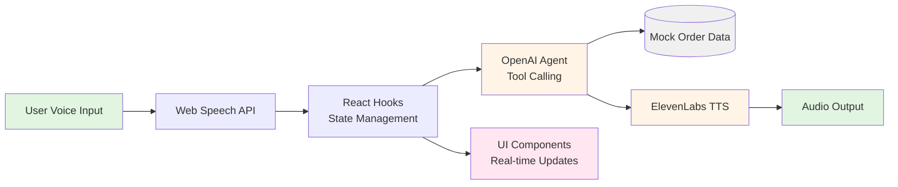

# Voice Agent for Customer Support

A voice-first customer support demo built with React + Vite.

The app listens to a customer request, runs an OpenAI tool-calling loop against mock order data, and responds with synthesized speech

## Demo video

*Demo video shows that you an talk to agent for your order support. Github doesn't allows to show videos - so video is in "docs/" folder.*

## Usage

1. Click the mic button in the Customer panel.
2. Ask about an order ID (for example, `DD-1044`).
3. Observe reasoning events in the middle panel.
4. Listen to the spoken response.
5. Tap the mic while audio is playing to interrupt and continue speaking.

Use `New Chat` in the header to reset conversation state.

## Example Prompts

- "My order DD-1044 had missing items and I want a refund."
- "Can you cancel order DD-1048?"
- "What is the status of DD-1045?"
- "I never got my food from order 10:44."

## Features

- Browser speech recognition (Chrome)
- Multi-turn conversation context
- Tool-calling workflow for order operations
- Real-time reasoning timeline UI
- Interruptible text-to-speech playback
- Order ID normalization from spoken variants (for example, `10:44` -> `DD-1044`)

## Demo Operations

The assistant can invoke these local tools:

- `check_order_status(order_id)`
- `process_refund(order_id)`
- `cancel_order(order_id)`

Demo order IDs are `DD-1042` through `DD-1051`.

## Tech Stack

- React 19
- Vite 7
- OpenAI Chat Completions API (tool calling)
- ElevenLabs Text-to-Speech API
- Web Speech API (speech input)

## Prerequisites

- Node.js 18+
- npm 9+
- Google Chrome (recommended for Web Speech API support)
- OpenAI API key
- ElevenLabs API key

## Quick Start

1. Install dependencies.

```bash
npm install
```

2. Create your local environment file.

```bash
cp .env.example .env
```

3. Configure API keys in `.env`.

```env
VITE_OPENAI_API_KEY=sk-...
VITE_ELEVENLABS_API_KEY=sk_...
```

4. Start the development server.

```bash
npm run dev
```

5. Open `http://localhost:5173` in Chrome.

## Available Scripts

| Command             | Description                      |
| ------------------- | -------------------------------- |
| `npm run dev`     | Start local development server   |
| `npm run build`   | Build production assets          |
| `npm run preview` | Preview production build locally |
| `npm run lint`    | Run ESLint checks                |

## Project Structure

```text
src/
    components/
        CustomerPanel.jsx
        ReasoningPanel.jsx
        OrdersPanel.jsx
    hooks/
        useSpeechRecognition.js
        useVoiceAgent.js
    services/
        openaiAgent.js
        elevenlabs.js
    data/
        orders.js
```

## Technical Architecture



**Architecture Overview**

The application uses a four-layer architecture:

- **UI Layer**: React components (`CustomerPanel`, `ReasoningPanel`, `OrdersPanel`) display conversation, reasoning steps, and order data
- **Logic Layer**: Custom hooks (`useVoiceAgent`, `useSpeechRecognition`) manage state and coordinate the voice interaction flow
- **Service Layer**: OpenAI agent handles tool-calling loops; ElevenLabs service converts responses to speech
- **Data Layer**: In-memory mock order database for tool execution

**Flow**: User speaks → Web Speech API transcribes → React hooks normalize and process → OpenAI decides which tools to call → Tools execute against local data → Response synthesized to speech via ElevenLabs → Audio plays

**Key Notes**

- Client-side only demo application
- Tool execution is local against in-memory mock order data
- Conversation history is maintained in memory during the session
- API keys are read from Vite environment variables

## Troubleshooting

- Mic button is disabled:
  - Ensure you are using Chrome.
  - Confirm microphone permission is granted for `localhost`.
- No speech output:
  - Verify `VITE_ELEVENLABS_API_KEY` in `.env`.
  - Check browser autoplay/audio permissions.
- OpenAI request errors:
  - Verify `VITE_OPENAI_API_KEY` in `.env`.
  - Ensure the key has access to the configured model.

## Security Note

This repository is intended for demo and local development use.

Because API keys are used from the browser environment, do not deploy this version directly to production. For production, route model and TTS requests through a secure backend.
